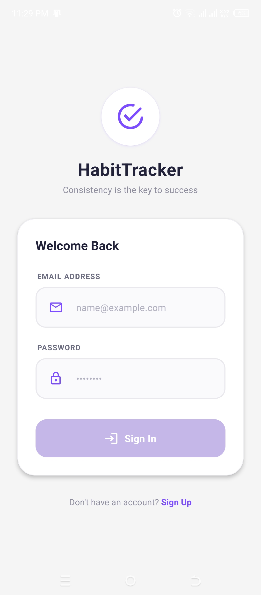
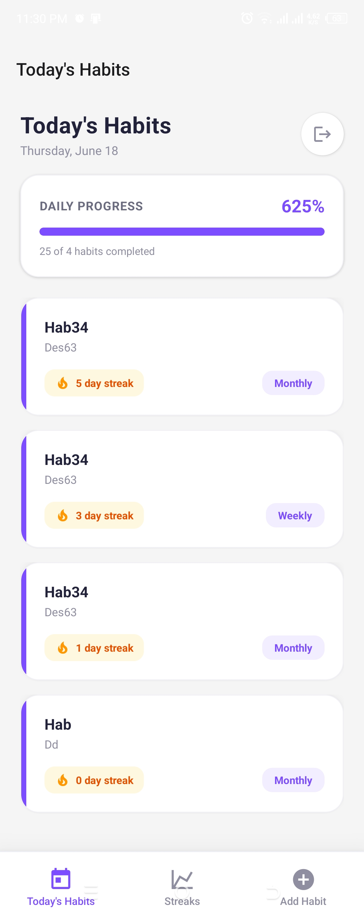
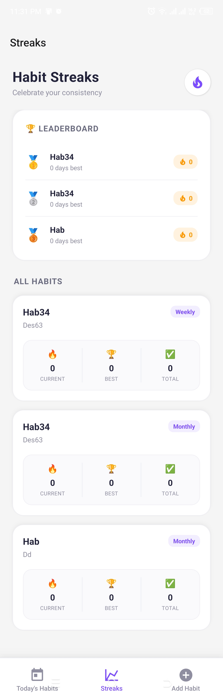
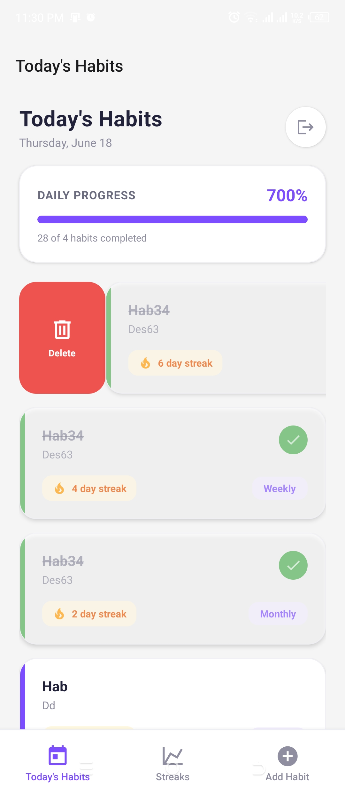
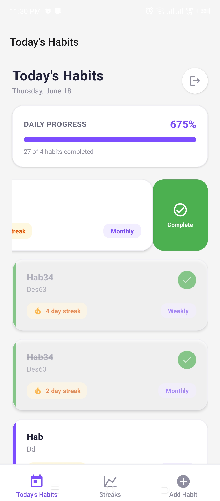
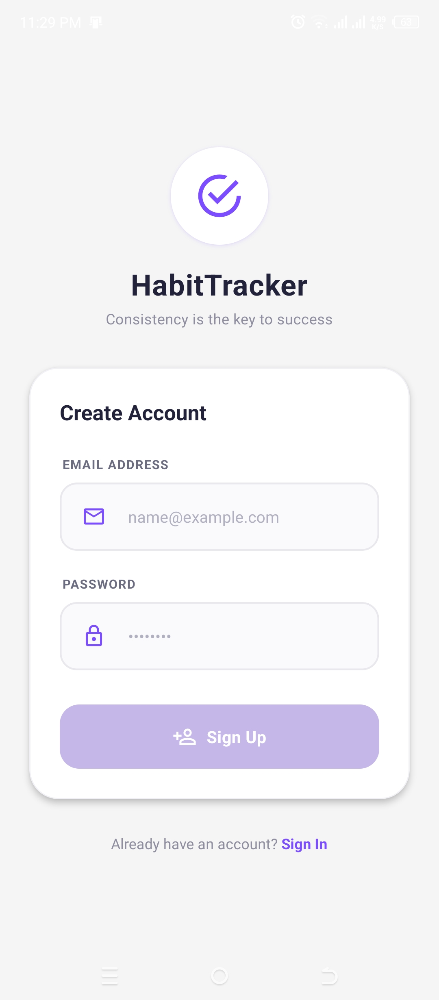

# 🌱 HabitTracker — Premium React Native App

HabitTracker is a modern, premium, and cross-platform mobile application designed to help users build consistency and track their habits in real-time. Built on top of **React Native** and **Expo**, and powered by **Appwrite**, the app offers a fluid user experience, real-time synchronization, and local optimistic state updates for instant UI responses.

---

## 📸 Screen Showcase

### Core Experience

| 🔐 Welcome & Auth | ✨ Add New Habit | 📅 Today's Habits | 🏆 Habit Streaks & Leaderboard |
| :---: | :---: | :---: | :---: |
|  |  |  |  |

### Gestures & Secondary Screens

| 🗑️ Swipe to Delete | ✅ Swipe to Complete | 📝 Sign Up Screen |
| :---: | :---: | :---: |
|  |  |  |

---

## ✨ Key Features

- **🎨 Premium Visual Aesthetics**: Tailored color palettes, custom cards with left accent borders, elegant layouts, and beautiful typography (Inter / Outfit style).
- **⚡ Optimistic State Updates**: Creating, deleting, and marking habits as completed update the UI instantly, rolling back gracefully only if the background request fails.
- **🔄 Real-time Synchronization**: Powered by Appwrite WebSockets, changes are synced across devices instantly.
- **🏆 Streaks & Leaderboard**: Calculates current streaks, best streaks, and total completions with a podium style top leaderboard.
- **📱 Fluid Swiping Gestures**: Built with React Native Gesture Handler for smooth native swiping motions to complete or delete habits.
- **🔒 Secure Authentication**: Seamless Sign In / Sign Up flow with validation and clear user feedback.

---

## 🛠️ Technical Stack & Dependencies

- **Framework**: Expo v54.0.0
- **Language**: TypeScript
- **Database / Backend**: Appwrite Cloud
- **UI Components**: React Native Paper
- **Gestures**: React Native Gesture Handler & Reanimated

To install the primary libraries used in this project, run the following commands:

```bash
# Install Appwrite SDK and Polyfill
npx expo install react-native-appwrite react-native-url-polyfill

# Install UI Component Library
npx expo install react-native-paper

# Install Gesture Handler
npx expo install react-native-gesture-handler
```

---

## 🚀 Getting Started

### 1. Install Dependencies
```bash
npm install
```

### 2. Configure Environment Variables
Create a `.env` file in the root directory and configure your Appwrite project credentials:
```env
EXPO_PUBLIC_APPWRITE_ENDPOINT=https://cloud.appwrite.io/v1
EXPO_PUBLIC_APPWRITE_PROJECT_ID=your_project_id
EXPO_PUBLIC_APPWRITE_DATABASE_ID=your_database_id
EXPO_PUBLIC_HABITS_COLLECTION_ID=your_habits_collection_id
EXPO_PUBLIC_COMPLETIONS_COLLECTION_ID=your_completions_collection_id
```

### 3. Start the Development Server
```bash
npx expo start
```
From the CLI interface, you can open the project in:
- **Android emulator** (`a`)
- **iOS simulator** (`i`)
- **Expo Go** on physical device
- **Web browser** (`w`)

---

## 📁 Project Structure

```
├── app/                  # File-based routing (Expo Router)
│   ├── (tabs)/           # Main tab bar routes
│   │   ├── _layout.tsx   # Tabs configuration (colors, icons)
│   │   ├── index.tsx     # Today's habits (progress, swiping, listing)
│   │   ├── streaks.tsx   # Leaderboard & statistics
│   │   └── add-habit.tsx # Custom add habit form
│   ├── _layout.tsx       # Root layout & authentication guard routing
│   └── auth.tsx          # Login & SignUp screen
├── lib/                  # Appwrite services and global context
│   ├── appwrite.ts       # SDK init & collections constants
│   └── auth-context.tsx  # Authentication provider & user session hook
├── types/                # TypeScript interfaces
│   └── database.type.ts  # Habits and completions schema types
└── screenshot/           # Screenshots folder for documentation
```
